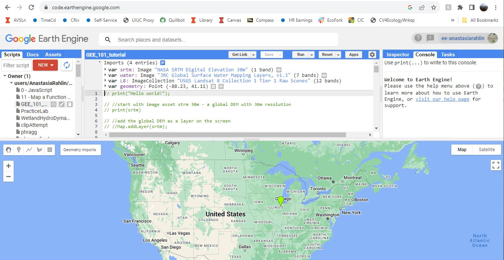

## Create your Google Earth Engine (GEE) account

With your Google Earth Engine account, you can access and manipulate many GIS layers for free.
 
1. Make sure you've logged out of all gmail accounts except for the one you want to use for GEE.
2. Go to [https://earthengine.google.com](https://earthengine.google.com)
3. In the top right corner, click "Get Started"
4. Sign into your gmail account
5. Register as a non-commercial (free) user
6. **Wait ~2 days for Google to approve your account. You might get immediate access, or this process might take up to a week.**
7. Go to your GEE page at [https://code.earthengine.google.com/](https://code.earthengine.google.com/)
8. Your screen should look something like this:

 
